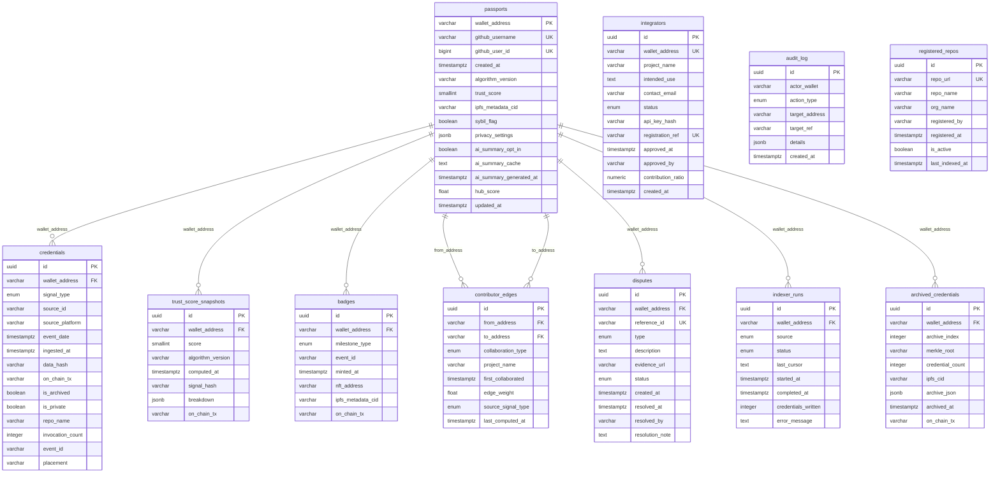

# ForgePass — PostgreSQL Schema ERD

> **Authoritative schema reference for `forgepass-core/apps/api`.**
> Issue #013 · Phase 0 · Based on FRD v1.1 + Issues v1.1
>
> All column definitions in this document are the source of truth for migration
> files in #030. No migration file may be written before this document is
> reviewed and signed off by at least two team members.
>
> **Status:** In progress — Steps 2–5 of #013 execution plan.

---

## 1. Overview

This document specifies the full PostgreSQL schema for `forgepass-core/apps/api`.
It covers all 10 tables from the master inventory established in #013 Step 1, plus
one additional table (`archived_credentials`) required by the #003 archival strategy
and absent from the #030 migration list — flagged here for correction.

**FRD coverage:** Sections 17.1–17.5 (data models) · NFR 16.5 (scalability:
100,000+ records without index redesign) · Section 19 (Phase 2 gate).

**Issues directly unblocked:** #030 (database migrations) and every Phase 2 issue
that reads from or writes to the database (#023, #028, #031–#037, #041–#043).

**Dependency outputs read:**
- `scoring/algorithm-v1.0.json` — signal_type enum values and scoring weights (#001)
- `contracts/ARCHITECTURE.md` — archival strategy and storage limit (#003)
- `contracts/badges/milestone-registry.json` — milestone_type enum values (#008)

### Key decisions made in #013

| Decision | Resolution |
|---|---|
| UUID version | UUID v7 for all UUID primary keys, generated at NestJS application layer before insert. No PostgreSQL extension required. |
| `is_private` on credentials | Stored `BOOLEAN NOT NULL DEFAULT FALSE` column. Maintained by a PostgreSQL trigger on `passports.privacy_settings` UPDATE. Scoring engine queries without filter; all public-facing services use `WHERE is_private = FALSE`. |
| `contributor_edges` uniqueness | DB-level `UNIQUE (from_address, to_address, collaboration_type, project_name)`. GraphService uses `INSERT ... ON CONFLICT DO UPDATE` for atomic upserts. Prevents phantom edges from corrupting hub computation. |
| `signal_type` enum count | **Five values**: GITHUB_PR, SOROBAN_CONTRACT, STELLAR_DEX, AQUARIUS_LP, HACKATHON. FRD §17.2 and #030 migration doc list four values omitting AQUARIUS_LP — confirmed error of omission in #013 Step 1. Migration 002 uses five values. |
| `privacy_settings` default | Five keys: `{"github":true,"soroban":true,"dex":true,"aquarius":true,"hackathon":true}`. Updated from the four-key default in the issue roadmap doc to reflect the five-value signal_type enum. |
| `archived_credentials` table | 11th table required by #003 archival strategy. Added as migration 011. Absent from #030 issue doc — must be corrected before #030 is written. |
| JSONB GIN indexes | Deferred — see §8. |

---

## 2. Entity Relationship Diagram



---

## 3. Core Entity Tables

### 3.1 passports

Primary key: `wallet_address VARCHAR(56)` — Stellar G-address, always 56 characters.

| Column | PostgreSQL Type | Nullable | Constraints | Notes |
|---|---|---|---|---|
| wallet_address | VARCHAR(56) | NOT NULL | PRIMARY KEY | Stellar public key. FRD §17.1. |
| github_username | VARCHAR(255) | NOT NULL | UNIQUE | Verified GitHub identity. FRD §17.1. |
| github_user_id | BIGINT | NOT NULL | UNIQUE | GitHub numeric user ID. Prevents username rename attacks. Decision #002. |
| created_at | TIMESTAMPTZ | NOT NULL | DEFAULT NOW() | Passport creation date. FRD §17.1. |
| algorithm_version | VARCHAR(20) | NOT NULL | DEFAULT '1.0' | Algorithm version of last applied score. FRD §17.1. |
| trust_score | SMALLINT | NOT NULL | DEFAULT 0, CHECK (trust_score BETWEEN 0 AND 100) | 0–100 normalised score. SMALLINT sufficient; saves 2 bytes vs INTEGER at 100K rows. FRD §17.1. |
| ipfs_metadata_cid | VARCHAR(256) | NULL | — | CID of passport metadata on IPFS/Arweave. Null until first metadata upload. FRD §17.1. |
| sybil_flag | BOOLEAN | NOT NULL | DEFAULT FALSE | Admin-set. Excludes passport from public API responses when TRUE. FRD §17.1, FR-11.1. |
| privacy_settings | JSONB | NOT NULL | DEFAULT '{"github":true,"soroban":true,"dex":true,"aquarius":true,"hackathon":true}' | Per-signal visibility map. Five keys reflecting v1 signal_type enum. FRD §17.1, FR-02.6. See §8 for GIN index decision. |
| ai_summary_opt_in | BOOLEAN | NOT NULL | DEFAULT FALSE | AI summary generation enabled. Default off per FR-12.1. FRD §17.1. |
| ai_summary_cache | TEXT | NULL | — | Cached AI summary text. Null until opt-in and first generation. Deleted immediately on opt-out per FR-12.6. FRD §17.1. |
| ai_summary_generated_at | TIMESTAMPTZ | NULL | — | Timestamp of last generation. Enforces 24-hour regeneration cooldown. Decision #064. |
| hub_score | FLOAT | NULL | CHECK (hub_score >= 0.0) | Betweenness centrality score. Written by hub computation (#068). Null until first graph build runs. |
| updated_at | TIMESTAMPTZ | NOT NULL | DEFAULT NOW() | Maintained by trigger on any column change. Enables cache invalidation downstream. |

**Triggers on passports:**

`trg_passports_updated_at` — fires BEFORE UPDATE, sets `updated_at = NOW()`.

```sql
CREATE OR REPLACE FUNCTION set_updated_at()
RETURNS TRIGGER AS $$
BEGIN
  NEW.updated_at = NOW();
  RETURN NEW;
END;
$$ LANGUAGE plpgsql;

CREATE TRIGGER trg_passports_updated_at
  BEFORE UPDATE ON passports
  FOR EACH ROW EXECUTE FUNCTION set_updated_at();
```

`trg_propagate_privacy` — fires AFTER UPDATE OF privacy_settings. Propagates
visibility changes to all credential rows for the affected wallet. Maps the five
human-readable privacy_settings keys to signal_type_enum values.

```sql
CREATE OR REPLACE FUNCTION propagate_privacy_settings()
RETURNS TRIGGER AS $$
DECLARE
  sig          TEXT;
  sig_types    TEXT[] := ARRAY['github','soroban','dex','aquarius','hackathon'];
  sig_map      JSONB  := '{
    "github":   "GITHUB_PR",
    "soroban":  "SOROBAN_CONTRACT",
    "dex":      "STELLAR_DEX",
    "aquarius": "AQUARIUS_LP",
    "hackathon":"HACKATHON"
  }';
  new_visible  BOOLEAN;
BEGIN
  IF NEW.privacy_settings IS DISTINCT FROM OLD.privacy_settings THEN
    FOREACH sig IN ARRAY sig_types LOOP
      new_visible := (NEW.privacy_settings ->> sig)::boolean;
      UPDATE credentials
        SET    is_private = NOT new_visible
        WHERE  wallet_address = NEW.wallet_address
          AND  signal_type    = (sig_map ->> sig)::signal_type_enum;
    END LOOP;
  END IF;
  RETURN NEW;
END;
$$ LANGUAGE plpgsql;

CREATE TRIGGER trg_propagate_privacy
  AFTER UPDATE OF privacy_settings ON passports
  FOR EACH ROW EXECUTE FUNCTION propagate_privacy_settings();
```

---

### 3.2 credentials

Primary key: `id UUID` — v7, generated at NestJS application layer before insert.

| Column | PostgreSQL Type | Nullable | Constraints | Notes |
|---|---|---|---|---|
| id | UUID | NOT NULL | PRIMARY KEY | UUID v7, app-layer generated. FRD §17.2. |
| wallet_address | VARCHAR(56) | NOT NULL | FK → passports(wallet_address) ON DELETE RESTRICT ON UPDATE CASCADE | FRD §17.2. |
| signal_type | signal_type_enum | NOT NULL | Part of UNIQUE constraint below | Five v1 values. FRD §17.2 (see §5 for corrected enum). |
| source_id | VARCHAR(512) | NOT NULL | Part of UNIQUE constraint below | External reference: GitHub PR node ID, Stellar tx hash, contract address, event slug. FRD §17.2. |
| source_platform | VARCHAR(100) | NOT NULL | — | Origin platform name: 'github', 'horizon', 'aquarius', 'forgepass-admin'. FRD §17.2. |
| event_date | TIMESTAMPTZ | NOT NULL | — | When the contribution occurred. FRD §17.2. |
| ingested_at | TIMESTAMPTZ | NOT NULL | DEFAULT NOW() | When ForgePass recorded it. FRD §17.2. |
| data_hash | VARCHAR(64) | NOT NULL | — | SHA-256 hex of raw signal data. Used for on-chain anchoring. FRD §17.2. |
| on_chain_tx | VARCHAR(128) | NULL | — | Stellar tx ID of on-chain credential write. Null until write confirms. FRD §17.2. |
| is_archived | BOOLEAN | NOT NULL | DEFAULT FALSE | TRUE when credential is moved to archival batch per #003 strategy. Archived rows excluded from active scoring runs. |
| is_private | BOOLEAN | NOT NULL | DEFAULT FALSE | Maintained by `trg_propagate_privacy` trigger (§3.1). Scoring engine queries all rows regardless; all public-facing services add `WHERE is_private = FALSE`. Decision OQ-5. |
| repo_name | VARCHAR(255) | NULL | — | GITHUB_PR rows only. Required for MULTI_REPO_CONTRIBUTOR badge trigger (COUNT DISTINCT repo_name). Decision #008. |
| invocation_count | INTEGER | NOT NULL | DEFAULT 0 | SOROBAN_CONTRACT rows only. Refreshed on every incremental Soroban index cycle — not only on initial detection. Required for FIRST_SOROBAN_INVOCATION trigger. Decision #008. |
| event_id | VARCHAR(255) | NULL | — | HACKATHON rows only. Admin-assigned event slug from CSV ingestion. Required for per-event HACKATHON_PARTICIPANT dedup. Decision #008. |
| placement | VARCHAR(50) | NULL | CHECK (placement IN ('1st','2nd','3rd','finalist','participant') OR placement IS NULL) | HACKATHON rows only. Captured from v1 for future placement-tier badges. Decision #008. |

**Deduplication unique constraint (DB-level — prevents duplicates surviving a code bug):**

```sql
ALTER TABLE credentials
  ADD CONSTRAINT uq_credentials_dedup
  UNIQUE (wallet_address, signal_type, source_id);
```

---

### 3.3 trust_score_snapshots

Primary key: `id UUID` — v7, generated at NestJS application layer before insert.

| Column | PostgreSQL Type | Nullable | Constraints | Notes |
|---|---|---|---|---|
| id | UUID | NOT NULL | PRIMARY KEY | UUID v7, app-layer generated. FRD §17.3. |
| wallet_address | VARCHAR(56) | NOT NULL | FK → passports(wallet_address) ON DELETE RESTRICT ON UPDATE CASCADE | FRD §17.3. |
| score | SMALLINT | NOT NULL | CHECK (score BETWEEN 0 AND 100) | 0–100 normalised Trust Score. FRD §17.3. |
| algorithm_version | VARCHAR(20) | NOT NULL | — | e.g. '1.0', '1.1'. Tagged per FR-04.2. FRD §17.3. |
| computed_at | TIMESTAMPTZ | NOT NULL | — | When this snapshot was computed. FRD §17.3. |
| signal_hash | VARCHAR(64) | NOT NULL | — | SHA-256 of the input signal set used for this computation. Enables idempotency verification per FR-04.3. FRD §17.3. |
| breakdown | JSONB | NOT NULL | — | Per-signal breakdown: `{ signal_type, raw_value, weight, contribution }`. FRD §17.3. See §8 for GIN index decision. |
| on_chain_tx | VARCHAR(128) | NULL | — | Stellar tx ID of on-chain score anchor. Null until anchor confirms. FRD §17.3. |

---

### 3.4 badges

Primary key: `id UUID` — v7, generated at NestJS application layer before insert.

Duplicate prevention uses two partial unique indexes rather than one constraint.
`HACKATHON_PARTICIPANT` has `one_per_event` cardinality (one badge per wallet per
event_id); all other milestone types have `one_time` cardinality (one badge per
wallet per milestone_type). A single UNIQUE on `(wallet_address, milestone_type)`
would prevent a contributor from earning HACKATHON_PARTICIPANT at multiple events.

| Column | PostgreSQL Type | Nullable | Constraints | Notes |
|---|---|---|---|---|
| id | UUID | NOT NULL | PRIMARY KEY | UUID v7, app-layer generated. FRD §17.4. |
| wallet_address | VARCHAR(56) | NOT NULL | FK → passports(wallet_address) ON DELETE RESTRICT ON UPDATE CASCADE | FRD §17.4. |
| milestone_type | milestone_type_enum | NOT NULL | See partial unique indexes below | Seven active v1 values from milestone-registry.json (#008). FRD §17.4. |
| event_id | VARCHAR(255) | NULL | — | HACKATHON_PARTICIPANT rows only. NULL for all other milestone types. Decision #008. |
| minted_at | TIMESTAMPTZ | NOT NULL | — | On-chain mint timestamp. FRD §17.4. |
| nft_address | VARCHAR(128) | NULL | — | Stellar address of the soulbound NFT. Null until on-chain mint confirms. FRD §17.4. |
| ipfs_metadata_cid | VARCHAR(256) | NOT NULL | — | CID of badge metadata (name, description, image asset). FRD §17.4. |
| on_chain_tx | VARCHAR(128) | NULL | — | Stellar tx ID of the mint operation. Null until confirmed. FRD §17.4. |

**Partial unique indexes for duplicate prevention:**

```sql
-- All milestone types except HACKATHON_PARTICIPANT: one badge per type per wallet
CREATE UNIQUE INDEX uq_badges_one_time
  ON badges (wallet_address, milestone_type)
  WHERE milestone_type != 'HACKATHON_PARTICIPANT';

-- HACKATHON_PARTICIPANT only: one badge per event per wallet
CREATE UNIQUE INDEX uq_badges_per_event
  ON badges (wallet_address, milestone_type, event_id)
  WHERE milestone_type = 'HACKATHON_PARTICIPANT';
```

---

### 3.5 contributor_edges

Primary key: `id UUID` — v7, generated at NestJS application layer before insert.

GraphService uses `INSERT ... ON CONFLICT (from_address, to_address,
collaboration_type, project_name) DO UPDATE SET edge_weight = contributor_edges.edge_weight + 1,
last_computed_at = NOW()` for all edge writes. The unique constraint is the conflict
target index — no additional index required for upsert performance.

| Column | PostgreSQL Type | Nullable | Constraints | Notes |
|---|---|---|---|---|
| id | UUID | NOT NULL | PRIMARY KEY | UUID v7, app-layer generated. FRD §17.5. |
| from_address | VARCHAR(56) | NOT NULL | FK → passports(wallet_address) ON DELETE RESTRICT ON UPDATE CASCADE | FRD §17.5. |
| to_address | VARCHAR(56) | NOT NULL | FK → passports(wallet_address) ON DELETE RESTRICT ON UPDATE CASCADE | FRD §17.5. |
| collaboration_type | collaboration_type_enum | NOT NULL | Part of unique constraint below | v1: CO_PR, CO_CONTRACT. FRD §17.5. |
| project_name | VARCHAR(512) | NOT NULL | Part of unique constraint below | Repository or project where collaboration occurred. FRD §17.5. |
| first_collaborated | TIMESTAMPTZ | NOT NULL | — | Earliest detected collaboration event date. FRD §17.5. |
| edge_weight | FLOAT | NOT NULL | CHECK (edge_weight > 0), DEFAULT 1.0 | Count of shared collaboration events. Incremented by upsert on each new shared event. FRD §17.5. |
| source_signal_type | signal_type_enum | NOT NULL | — | Signal type that generated this edge. Required for privacy filter FR-06.6 (#069). |
| last_computed_at | TIMESTAMPTZ | NOT NULL | DEFAULT NOW() | Timestamp of last graph refresh that touched this edge. Used by incremental update logic. |

**Unique constraint — upsert conflict target (Decision OQ-7):**

```sql
ALTER TABLE contributor_edges
  ADD CONSTRAINT uq_edges_collaboration
  UNIQUE (from_address, to_address, collaboration_type, project_name);
```

---

## 4. Operational Tables

### 4.1 integrators

Primary key: `id UUID` — v7, generated at NestJS application layer.

Stores registered third-party projects authorised to call write endpoints. Admin
approves registrations via #042. `contribution_ratio` is the per-DAO governance
weight blend ratio from decision #006 — NULL means use the global default from
`governance-config.json`.

| Column | PostgreSQL Type | Nullable | Constraints | Notes |
|---|---|---|---|---|
| id | UUID | NOT NULL | PRIMARY KEY | UUID v7, app-layer generated. |
| wallet_address | VARCHAR(56) | NOT NULL | UNIQUE | Stellar wallet used to authenticate write requests. FR-09.5. |
| project_name | VARCHAR(255) | NOT NULL | — | Human-readable project name. FR-09.5. |
| intended_use | TEXT | NOT NULL | — | Stated use case. Reviewed by admin at approval. FR-09.5. |
| contact_email | VARCHAR(255) | NOT NULL | — | Contact for registration correspondence. |
| status | integrator_status_enum | NOT NULL | DEFAULT 'PENDING' | PENDING → APPROVED or REJECTED. FR-09.5. |
| api_key_hash | VARCHAR(64) | NULL | — | SHA-256 of the issued API key. Null until approved. Plaintext key never stored. |
| registration_ref | VARCHAR(32) | NOT NULL | UNIQUE | Human-readable reference returned to registrant on submission (e.g. INT-2026-001). |
| approved_at | TIMESTAMPTZ | NULL | — | Null until admin approves. |
| approved_by | VARCHAR(56) | NULL | — | Admin wallet address that approved the registration. |
| contribution_ratio | NUMERIC(4,3) | NULL | CHECK (contribution_ratio IS NULL OR (contribution_ratio >= 0.10 AND contribution_ratio <= 0.70)) | Per-DAO governance blend ratio. NULL = use global default (0.30). Decision #006. |
| created_at | TIMESTAMPTZ | NOT NULL | DEFAULT NOW() | Registration submission timestamp. |

---

### 4.2 audit_log

Primary key: `id UUID` — v7, generated at NestJS application layer.

Append-only. No row may be modified or deleted after insert. Enforced at the DB
layer by trigger (Decision OQ-3). Application layer in #042 also never issues
UPDATE or DELETE — but the trigger is the authoritative guarantee.

| Column | PostgreSQL Type | Nullable | Constraints | Notes |
|---|---|---|---|---|
| id | UUID | NOT NULL | PRIMARY KEY | UUID v7, app-layer generated. |
| actor_wallet | VARCHAR(56) | NOT NULL | — | Admin wallet address performing the action. FR-11.6. |
| action_type | audit_action_enum | NOT NULL | — | Typed action identifier. FR-11.6. |
| target_address | VARCHAR(56) | NULL | — | Passport wallet address affected, where applicable. FR-11.6. |
| target_ref | VARCHAR(256) | NULL | — | Secondary reference: repo URL, integrator ID, algorithm version, etc. FR-11.6. |
| details | JSONB | NOT NULL | DEFAULT '{}' | Action-specific metadata. Schema varies by action_type. FR-11.6. |
| created_at | TIMESTAMPTZ | NOT NULL | DEFAULT NOW() | Immutable. Protected by DB trigger below. FR-11.6. |

**Trigger — append-only enforcement (Decision OQ-3):**

```sql
CREATE OR REPLACE FUNCTION prevent_audit_log_mutation()
RETURNS TRIGGER AS $$
BEGIN
  RAISE EXCEPTION
    'audit_log is append-only. UPDATE and DELETE are not permitted. (FR-11.6)';
  RETURN NULL;
END;
$$ LANGUAGE plpgsql;

CREATE TRIGGER trg_audit_log_immutable
  BEFORE UPDATE OR DELETE ON audit_log
  FOR EACH ROW EXECUTE FUNCTION prevent_audit_log_mutation();
```

---

### 4.3 disputes

Primary key: `id UUID` — v7, generated at NestJS application layer.

The 3-open-dispute limit per contributor (FR-11.2, #043) is enforced at the
application layer in #043, not at the DB layer. A DB-level constraint on open
dispute count requires a complex deferred trigger or a serialisable transaction;
application enforcement is the correct boundary for this rule.

| Column | PostgreSQL Type | Nullable | Constraints | Notes |
|---|---|---|---|---|
| id | UUID | NOT NULL | PRIMARY KEY | UUID v7, app-layer generated. |
| wallet_address | VARCHAR(56) | NOT NULL | FK → passports(wallet_address) ON DELETE RESTRICT ON UPDATE CASCADE | FR-11.2. |
| reference_id | VARCHAR(32) | NOT NULL | UNIQUE | Human-readable case ID returned to contributor on submission (e.g. DSP-2026-001). FR-11.2. |
| type | dispute_type_enum | NOT NULL | — | FLAG_DISPUTE, MISSING_CREDENTIAL, or INCORRECT_CREDENTIAL. FR-11.2. Decision #002 defines ONBOARDING_GATE_REJECTION and DUPLICATE_IDENTITY as dispute types — these map to FLAG_DISPUTE for schema purposes; the details JSONB carries the sub-type. |
| description | TEXT | NOT NULL | — | Contributor-provided description of the dispute. FR-11.2. |
| evidence_url | VARCHAR(1024) | NULL | — | Optional link to supporting evidence. FR-11.2. |
| status | dispute_status_enum | NOT NULL | DEFAULT 'OPEN' | FR-11.2. |
| created_at | TIMESTAMPTZ | NOT NULL | DEFAULT NOW() | |
| resolved_at | TIMESTAMPTZ | NULL | — | Null until status transitions to RESOLVED or REJECTED. |
| resolved_by | VARCHAR(56) | NULL | — | Admin wallet address. |
| resolution_note | TEXT | NULL | — | Admin-written resolution summary. |

---

### 4.4 registered_repos

Primary key: `id UUID` — v7, generated at NestJS application layer.

Repos are never hard-deleted. Deregistration sets `is_active = FALSE`, preserving
all historical credential records that reference the repo. The cross-project
indexer (#031) filters `WHERE is_active = TRUE` when scanning for new activity.
FR-03.11, FR-11.4.

| Column | PostgreSQL Type | Nullable | Constraints | Notes |
|---|---|---|---|---|
| id | UUID | NOT NULL | PRIMARY KEY | UUID v7, app-layer generated. |
| repo_url | VARCHAR(1024) | NOT NULL | UNIQUE | Full GitHub URL (e.g. https://github.com/stellar/stellar-core). FR-11.4. |
| repo_name | VARCHAR(255) | NOT NULL | — | Short display name for UI and logs. |
| org_name | VARCHAR(255) | NOT NULL | — | GitHub organisation or user owning the repo. |
| registered_by | VARCHAR(56) | NOT NULL | — | Admin wallet that registered this repo. |
| registered_at | TIMESTAMPTZ | NOT NULL | DEFAULT NOW() | |
| is_active | BOOLEAN | NOT NULL | DEFAULT TRUE | FALSE on deregistration. Historical credentials are never deleted. FR-03.11. |
| last_indexed_at | TIMESTAMPTZ | NULL | — | Updated by GitHub indexer on each successful run for this repo. NULL = never indexed. |

---

### 4.5 indexer_runs

Primary key: `id UUID` — v7, generated at NestJS application layer.

One row per `(wallet_address, source)` pair per run (Decision OQ-4 — consistent
with #004 per-contributor per-pass-type failure isolation). `wallet_address` is
nullable to accommodate admin-triggered full-scan runs not tied to a specific
contributor. `last_cursor` format is source-specific: GitHub uses a merged_at
ISO 8601 timestamp, Horizon passes use a `paging_token` string (per #004
decisions).

| Column | PostgreSQL Type | Nullable | Constraints | Notes |
|---|---|---|---|---|
| id | UUID | NOT NULL | PRIMARY KEY | UUID v7, app-layer generated. |
| wallet_address | VARCHAR(56) | NULL | FK → passports(wallet_address) ON DELETE SET NULL ON UPDATE CASCADE | NULL for full-scan runs. SET NULL on passport delete preserves run history. FR-03.9. Decision OQ-4. |
| source | indexer_source_enum | NOT NULL | — | GITHUB, HORIZON, SOROBAN, or HACKATHON. FR-03.9. |
| status | indexer_status_enum | NOT NULL | DEFAULT 'RUNNING' | RUNNING → COMPLETED or FAILED. FR-03.9. |
| last_cursor | TEXT | NULL | — | Opaque resume cursor. NULL on first run. Source formats: GitHub = merged_at ISO 8601 timestamp; Horizon = paging_token string. Decision #004. |
| started_at | TIMESTAMPTZ | NOT NULL | DEFAULT NOW() | |
| completed_at | TIMESTAMPTZ | NULL | — | NULL until status transitions to COMPLETED or FAILED. |
| credentials_written | INTEGER | NOT NULL | DEFAULT 0 | Count of new credential rows written in this run. Used for run reporting and monitoring. |
| error_message | TEXT | NULL | — | Populated when status = FAILED. Stored for alert and retry logic. FR-03.10. |

---

### 4.6 archived_credentials

Primary key: `id UUID` — v7, generated at NestJS application layer.

**Migration 011** — required by #003 archival strategy. Absent from the #030
issue doc migration list (which runs to migration 010). Must be added to #030
before migration files are written.

Stores the Merkle root, IPFS CID, and a PostgreSQL backup of each archived
credential batch. When `credentials.is_archived = TRUE` is set on a batch,
the corresponding archive record here holds the full audit trail and re-pin
source. Write order per #003: PostgreSQL first → IPFS upload → on-chain write.
If IPFS upload fails, the cycle aborts and retries on the next indexer run —
the batch remains unarchived and the `archive_json` here is not written.

| Column | PostgreSQL Type | Nullable | Constraints | Notes |
|---|---|---|---|---|
| id | UUID | NOT NULL | PRIMARY KEY | UUID v7, app-layer generated. |
| wallet_address | VARCHAR(56) | NOT NULL | FK → passports(wallet_address) ON DELETE RESTRICT ON UPDATE CASCADE | Decision #003. |
| archive_index | INTEGER | NOT NULL | Part of UNIQUE(wallet_address, archive_index) | Monotonically increasing per wallet, never reused. Matches the on-chain `archive_index` in the Soroban ArchiveRecord. Decision #003. |
| merkle_root | VARCHAR(64) | NOT NULL | — | SHA-256 Merkle root of the archived credential set. Leaf ordering: sorted by event_date ASC. Decision #003. |
| credential_count | INTEGER | NOT NULL | — | Number of credentials included in this archive batch (50 per cycle per #003). |
| ipfs_cid | VARCHAR(256) | NOT NULL | — | CID of archived credentials JSON on IPFS/Pinata. Source for re-pinning if pin becomes unavailable. Decision #003. |
| archive_json | JSONB | NOT NULL | — | Full PostgreSQL backup of the archive content. Used to re-pin from local data if IPFS CID is unreachable. Decision #003. |
| archived_at | TIMESTAMPTZ | NOT NULL | DEFAULT NOW() | |
| on_chain_tx | VARCHAR(128) | NULL | — | Stellar tx ID of on-chain ArchiveRecord write. Null until confirmed. Decision #003. |

**Unique constraint:**

```sql
ALTER TABLE archived_credentials
  ADD CONSTRAINT uq_archived_credentials_index
  UNIQUE (wallet_address, archive_index);
```

---

## 5. Enum Type Definitions

Extension instruction for all enum types:

```sql
ALTER TYPE <enum_name> ADD VALUE '<NEW_VALUE>';
```

This is a non-blocking DDL statement in PostgreSQL 12+. It does not rewrite existing
rows. New values are added in the same migration as the feature that produces them.

### signal_type_enum

> Sourced from: `scoring/algorithm-v1.0.json` (#001) for scored types and
> `contracts/badges/milestone-registry.json` (#008) for HACKATHON.
>
> **Note:** FRD §17.2 and the #030 migration doc list four values, omitting
> AQUARIUS_LP. This is an error of omission confirmed in #013 Step 1.
> Migration 002 uses five values. AQUARIUS_LP and STELLAR_DEX have distinct
> raw values, normalisation formulas, and Horizon ingestion pass types and
> cannot share a signal_type.

```sql
CREATE TYPE signal_type_enum AS ENUM (
  'GITHUB_PR',
  'SOROBAN_CONTRACT',
  'STELLAR_DEX',
  'AQUARIUS_LP',
  'HACKATHON'
  -- Reserved (not yet active): 'SCF_GRANT', 'GRANTFOX_BOUNTY', 'TRUSTLESS_WORK'
  -- Add via ALTER TYPE when #009 confirms the corresponding partnership
);
```

| Value | Status | Score Weight | Signal Source |
|---|---|---|---|
| GITHUB_PR | Active v1 | 0.50 | GitHub — merged PRs in registered Stellar repos |
| SOROBAN_CONTRACT | Active v1 | 0.30 | Horizon — create_contract operations from linked wallet |
| STELLAR_DEX | Active v1 | 0.10 | Horizon — unique qualifying DEX trading pairs |
| AQUARIUS_LP | Active v1 | 0.10 | Horizon operations — LP position size × active duration weeks |
| HACKATHON | Active v1 | unscored | ForgePass admin — batch CSV ingestion only |
| SCF_GRANT | Reserved | TBD | Gated on #009 confirming SCF partnership + R07 active |
| GRANTFOX_BOUNTY | Reserved | TBD | Gated on #009 confirming GrantFox partnership + R05 active |
| TRUSTLESS_WORK | Reserved | TBD | Gated on #009 confirming Trustless Work partnership + R06 active |

### milestone_type_enum

> Sourced from: `contracts/badges/milestone-registry.json` (#008).
> Seven active v1 types. Three reserved.

```sql
CREATE TYPE milestone_type_enum AS ENUM (
  'FIRST_PR',
  'FIRST_CONTRACT',
  'HACKATHON_PARTICIPANT',
  'RISING_CONTRIBUTOR',
  'MULTI_REPO_CONTRIBUTOR',
  'FIRST_SOROBAN_INVOCATION',
  'FULL_STACK_BUILDER'
  -- Reserved (not yet active): 'FIRST_BOUNTY', 'FIRST_GRANT', 'FIRST_TRUSTLESS_WORK'
  -- Add via ALTER TYPE when signal source is confirmed and indexer is live
);
```

| Value | Status | Cardinality | Signal Type(s) |
|---|---|---|---|
| FIRST_PR | Active v1 | one_time | GITHUB_PR |
| FIRST_CONTRACT | Active v1 | one_time | SOROBAN_CONTRACT |
| HACKATHON_PARTICIPANT | Active v1 | one_per_event | HACKATHON |
| RISING_CONTRIBUTOR | Active v1 | one_time | GITHUB_PR |
| MULTI_REPO_CONTRIBUTOR | Active v1 | one_time | GITHUB_PR |
| FIRST_SOROBAN_INVOCATION | Active v1 | one_time | SOROBAN_CONTRACT |
| FULL_STACK_BUILDER | Active v1 | one_time | GITHUB_PR + SOROBAN_CONTRACT |
| FIRST_BOUNTY | Reserved | — | GRANTFOX_BOUNTY — gated on #009 + R05 |
| FIRST_GRANT | Reserved | — | SCF_GRANT — gated on #009 + R07 |
| FIRST_TRUSTLESS_WORK | Reserved | — | TRUSTLESS_WORK — gated on #009 + R06 |

### collaboration_type_enum

```sql
CREATE TYPE collaboration_type_enum AS ENUM (
  'CO_PR',
  'CO_CONTRACT'
  -- Reserved: 'CO_BOUNTY', 'CO_GRANT'
  -- Add via ALTER TYPE when GrantFox / SCF signal sources are introduced
);
```

| Value | Status | Detection Logic |
|---|---|---|
| CO_PR | Active v1 | Two contributors co-authored or co-reviewed PRs on same registered repo in same calendar quarter |
| CO_CONTRACT | Active v1 | Two contributors deployed contracts to the same registered Stellar project |
| CO_BOUNTY | Reserved | Gated on GrantFox partnership (#009) |
| CO_GRANT | Reserved | Gated on SCF partnership (#009) |

### Operational enum types

```sql
CREATE TYPE integrator_status_enum AS ENUM ('PENDING', 'APPROVED', 'REJECTED');

CREATE TYPE dispute_type_enum AS ENUM (
  'FLAG_DISPUTE',
  'MISSING_CREDENTIAL',
  'INCORRECT_CREDENTIAL'
);

CREATE TYPE dispute_status_enum AS ENUM (
  'OPEN',
  'UNDER_REVIEW',
  'RESOLVED',
  'REJECTED'
);

CREATE TYPE indexer_source_enum AS ENUM (
  'GITHUB',
  'HORIZON',
  'SOROBAN',
  'HACKATHON'
);

CREATE TYPE indexer_status_enum AS ENUM ('RUNNING', 'COMPLETED', 'FAILED');

CREATE TYPE audit_action_enum AS ENUM (
  'FLAG_PASSPORT',
  'UNFLAG_PASSPORT',
  'RELEASE_ALGORITHM',
  'REGISTER_REPO',
  'DEREGISTER_REPO',
  'APPROVE_INTEGRATOR',
  'REJECT_INTEGRATOR',
  'BULK_INGEST_HACKATHON',
  'DELETE_AI_SUMMARY'
);
```

---

## 6. Index Strategy

All indexes below are in addition to those implied by PRIMARY KEY, UNIQUE, and
FK constraints already defined in Sections 3–4. Migration numbers reference #030.

The governing rule: every index must trace to a specific query pattern from the
FRD or a closed issue decision. No speculative indexes.

### passports

| Index | Type | Columns / Condition | Query pattern served |
|---|---|---|---|
| idx_passports_trust_score | B-tree | trust_score | GET /v1/contributors?min_score= filter (FR-07.2) |
| idx_passports_hub_score | B-tree | hub_score DESC NULLS LAST | GET /v1/graph/hubs ORDER BY hub_score (#068) |
| idx_passports_sybil_flagged | Partial B-tree | wallet_address WHERE sybil_flag = TRUE | Admin sybil dashboard — highly selective, tiny result set (FR-11.1) |

### credentials

The UNIQUE index on `(wallet_address, signal_type, source_id)` is the primary
lookup index for deduplication and also narrows wallet + signal_type queries.
Additional indexes cover the remaining patterns.

| Index | Type | Columns / Condition | Query pattern served |
|---|---|---|---|
| uq_credentials_dedup | UNIQUE (defined §3.2) | (wallet_address, signal_type, source_id) | Deduplication constraint + wallet+signal lookups |
| idx_credentials_wallet_ingested | B-tree | (wallet_address, ingested_at DESC) | Incremental indexer cursor queries; credential timeline on dashboard (FR-03.9) |
| idx_credentials_live_public | Partial B-tree | (wallet_address, signal_type) WHERE is_archived = FALSE AND is_private = FALSE | Public API credential reads — most frequent query pattern (FR-02.6, FR-07.1) |
| idx_credentials_live_all | Partial B-tree | (wallet_address, signal_type) WHERE is_archived = FALSE | Scoring engine queries all live credentials regardless of is_private (FR-04.1) |
| idx_credentials_github_repo | Partial B-tree | (wallet_address, repo_name) WHERE signal_type = 'GITHUB_PR' AND is_archived = FALSE | MULTI_REPO_CONTRIBUTOR badge trigger — COUNT DISTINCT repo_name (#008) |
| idx_credentials_github_graph | Partial B-tree | (signal_type, event_date, wallet_address, repo_name) WHERE signal_type = 'GITHUB_PR' | Graph CO_PR edge detection — cross-contributor query grouped by repo + quarter (#066) |
| idx_credentials_hackathon | Partial B-tree | (wallet_address, event_id) WHERE signal_type = 'HACKATHON' | HACKATHON_PARTICIPANT per-event dedup lookup in BadgeService (#008) |

### trust_score_snapshots

| Index | Type | Columns / Condition | Query pattern served |
|---|---|---|---|
| idx_snapshots_wallet_time | B-tree | (wallet_address, computed_at DESC) | Score history endpoint; "get current score" (latest row per wallet) (FR-04.5) |
| idx_snapshots_algorithm | B-tree | algorithm_version | Bulk recalculation job — "get all scores under algorithm v1.0" (#042, FR-11.3) |

**No partitioning (Decision OQ-6):** At 100K contributors with ~30 scoring cycles
per contributor per year, the table reaches ~3M rows after year one. B-tree indexes
on `wallet_address` and `computed_at` are sufficient at this scale. Evaluate range
partitioning by `computed_at` year if the table exceeds 50M rows.

### badges

Partial unique indexes for duplicate prevention are defined in §3.4. Additional
index for display ordering:

| Index | Type | Columns / Condition | Query pattern served |
|---|---|---|---|
| idx_badges_wallet_minted | B-tree | (wallet_address, minted_at ASC) | Chronological badge display on dashboard and public profile (FR-05.5) |

### contributor_edges

The UNIQUE constraint on `(from_address, to_address, collaboration_type,
project_name)` doubles as the upsert conflict target index — no additional index
required for write performance.

| Index | Type | Columns / Condition | Query pattern served |
|---|---|---|---|
| uq_edges_collaboration | UNIQUE (defined §3.5) | (from_address, to_address, collaboration_type, project_name) | Upsert conflict target; edge existence check |
| idx_edges_from | B-tree | from_address | GET /v1/graph/:address — direct collaborators of a contributor (FR-06.3) |
| idx_edges_to | B-tree | to_address | Reverse lookup for hub betweenness centrality computation (#068) |
| idx_edges_signal_privacy | B-tree | (from_address, source_signal_type) | Privacy filter — exclude edges derived from private signals (FR-06.6, #069) |

### integrators

| Index | Type | Columns / Condition | Query pattern served |
|---|---|---|---|
| idx_integrators_pending | Partial B-tree | id WHERE status = 'PENDING' | Admin approval queue — GET /admin/integrators?status=pending (#042) |

### audit_log

| Index | Type | Columns / Condition | Query pattern served |
|---|---|---|---|
| idx_audit_target | B-tree | (target_address, created_at DESC) | "All actions affecting this passport" — admin dispute workflow (FR-11.6) |
| idx_audit_action_time | B-tree | (action_type, created_at DESC) | Admin filter by action type with time ordering (#042) |

### disputes

| Index | Type | Columns / Condition | Query pattern served |
|---|---|---|---|
| idx_disputes_wallet_open | Partial B-tree | wallet_address WHERE status = 'OPEN' | 3-open-dispute limit check in #043 — COUNT WHERE status = OPEN for wallet (FR-11.2) |

### registered_repos

| Index | Type | Columns / Condition | Query pattern served |
|---|---|---|---|
| idx_repos_active | Partial B-tree | id WHERE is_active = TRUE | Indexer queries active repos on every cycle — large table scan avoided (FR-03.11) |

### indexer_runs

| Index | Type | Columns / Condition | Query pattern served |
|---|---|---|---|
| idx_indexer_runs_lookup | B-tree | (wallet_address, source, started_at DESC) | "Get last successful run for this contributor + source" — incremental cursor fetch (FR-03.9) |
| idx_indexer_runs_failed | Partial B-tree | id WHERE status = 'FAILED' | Retry queue and alert monitoring — FR-03.10 requires alert after 3 consecutive failures |

---

## 7. Foreign Key Cascade Rules

All FK relationships and their cascade behaviour are summarised here. The design
principle is: RESTRICT on DELETE everywhere except `indexer_runs`, where SET NULL
preserves operational history.

| Table | FK Column | References | ON DELETE | ON UPDATE | Rationale |
|---|---|---|---|---|---|
| credentials | wallet_address | passports(wallet_address) | RESTRICT | CASCADE | Credentials cannot outlive a passport deletion at the DB layer. Aligns with FR-02.3 soulbound design. |
| trust_score_snapshots | wallet_address | passports(wallet_address) | RESTRICT | CASCADE | Score history is permanently tied to the passport record. |
| badges | wallet_address | passports(wallet_address) | RESTRICT | CASCADE | Soulbound NFT records cannot be orphaned. |
| contributor_edges | from_address | passports(wallet_address) | RESTRICT | CASCADE | Graph edges reference active passport holders. |
| contributor_edges | to_address | passports(wallet_address) | RESTRICT | CASCADE | Both ends of an edge must reference valid passports. |
| disputes | wallet_address | passports(wallet_address) | RESTRICT | CASCADE | Dispute records must remain traceable to the passport. |
| indexer_runs | wallet_address | passports(wallet_address) | SET NULL | CASCADE | Run history preserved for debugging even if passport is deleted. |
| archived_credentials | wallet_address | passports(wallet_address) | RESTRICT | CASCADE | Archive records tied permanently to the passport wallet. |

**ON DELETE RESTRICT rationale:** The FRD makes all passport records permanent by
design (FR-02.3 — non-revocability). The application layer handles off-chain
deletion requests (NFR 16.4 — contributor right to off-chain data deletion) by
nulling or clearing sensitive fields rather than deleting rows. The RESTRICT
cascade reflects this at the DB layer — it is a safety net, not a routine path.

**ON UPDATE CASCADE rationale:** Stellar wallet addresses are fixed-length G-addresses
derived from the public key. They should never change in practice. CASCADE on UPDATE
is a schema correctness measure rather than an expected operational event.

---

## 8. JSONB Indexing Decisions

**Decision OQ-2: No GIN indexes in v1.**

The four JSONB columns in the schema are:

| Table | Column | Query pattern | GIN needed? |
|---|---|---|---|
| passports | privacy_settings | Never filtered by key in any API query. The `trg_propagate_privacy` trigger propagates changes to `credentials.is_private`, eliminating the join pattern that would require GIN. | No |
| trust_score_snapshots | breakdown | Always fetched as a complete blob for a specific wallet. Never filtered by field content. No endpoint queries "find scores where GitHub contribution > X." | No |
| audit_log | details | Admin queries filter by `target_address` and `action_type` — both B-tree indexed. The `details` field is read, not searched. | No |
| archived_credentials | archive_json | Never queried by field. Present as a re-pin fallback only. | No |

**Boundary condition for future developers:** If a new query pattern requires
searching inside any of these JSONB columns — for example, a future admin endpoint
filtering by `breakdown` signal contributions, or a `details` search in the audit
log — evaluate a GIN index on that column at the time the pattern is introduced.
GIN indexes are expensive to maintain on high-write tables (credentials, audit_log);
confirm the query frequency justifies the write overhead before adding one.

---

## 9. Scalability Model

NFR 16.5 requires the schema to support 100,000+ contributor records without
index redesign. This section documents projected row counts and confirms the
index strategy meets that requirement.

### Row count projections at 100K contributors

| Table | Projected rows | Basis |
|---|---|---|
| passports | 100K | 1 row per contributor |
| credentials | ~5M | ~50 credentials per contributor avg (30 GitHub PRs + 10 DEX/Aquarius + 8 Soroban + 2 hackathons) |
| trust_score_snapshots | ~5M | ~50 snapshots per contributor avg (matches Soroban contract history cap from #003) |
| badges | ~700K | ~7 per contributor if all v1 milestones earned |
| contributor_edges | 2M–10M | Depends on collaboration density; graph is sparse at v1 ecosystem size |
| integrators | ~100 | Stable small set |
| audit_log | ~500K | Depends on admin activity volume |
| disputes | ~5K | Typically <5% of contributors file disputes |
| registered_repos | ~500 | Stable set of registered Stellar repos |
| indexer_runs | ~2M | Multiple runs per contributor per source over time |
| archived_credentials | ~10K | Edge case at v1 — most contributors take 3+ years to hit 100-credential limit (#003) |

### Critical table analysis

**credentials (~5M rows):** The highest-frequency write and read table.
The partial indexes on `(wallet_address, signal_type)` with `is_archived` and
`is_private` conditions reduce all scoring engine and public API reads to
wallet-scoped index scans of typically <100 rows. Deduplication check via the
UNIQUE index is a single key lookup. No redesign needed at 100K contributors.

**trust_score_snapshots (~5M rows):** The `(wallet_address, computed_at DESC)`
index makes both the current-score lookup and the history endpoint O(log n) on
the index, then a tiny sequential scan over the result set. No redesign needed.

**contributor_edges (2M–10M rows):** The `from_address` and `to_address` B-tree
indexes cover all collaborator queries. Hub computation (#068) does a full graph
scan weekly — this is acceptable as a scheduled batch operation. No redesign needed.

**indexer_runs (~2M rows):** The `(wallet_address, source, started_at DESC)` index
covers the most common pattern (get last cursor for a contributor + source) in a
single index scan. Failed-run monitoring uses the partial index. No redesign needed.

### Horizontal scaling

**API layer:** Stateless by design (NFR 16.5). All session state lives in Redis;
all persistent state in PostgreSQL. New API instances can be added behind a load
balancer without schema changes.

**Indexer pipeline:** Multiple indexer instances can run concurrently. Each claims
work by inserting a `RUNNING` row into `indexer_runs` using a `SELECT ... FOR UPDATE
SKIP LOCKED` pattern on a queue table — two instances cannot claim the same
contributor + source combination simultaneously. No schema changes required to
scale the indexer horizontally.

### Partitioning deferred

Range partitioning on `trust_score_snapshots.computed_at` was evaluated and deferred
(Decision OQ-6). At the projected row count of ~5M at 100K contributors, B-tree
indexes are sufficient. Re-evaluate if the table exceeds **50M rows** (approximately
year 16 at current growth projections, or earlier if scoring frequency increases
significantly). The load test in #072 will surface any degradation at realistic v1
scale before mainnet launch.

---

## 10. Open Questions at Close

### 10.1 All open questions resolved

All seven open questions embedded in #013 were resolved during Steps 1–4. No
unresolved design questions remain in this document.

| OQ | Question | Resolution | Step |
|---|---|---|---|
| OQ-1 | UUID v4 vs UUID v7 for primary keys | UUID v7, NestJS app-layer generated. No PostgreSQL extension required. | Step 2 |
| OQ-2 | GIN index on privacy_settings and breakdown JSONB | No GIN indexes in v1. is_private trigger eliminated primary use case. Boundary condition documented in §8. | Step 4 |
| OQ-3 | audit_log append-only — DB trigger or application layer | DB trigger (trg_audit_log_immutable). Raises exception on any UPDATE or DELETE. FR-11.6 uses the word immutable; trigger is the only way to mean it. | Step 3 |
| OQ-4 | indexer_runs granularity — per-contributor per-source or global | Per-contributor per-source. wallet_address nullable FK for full-scan runs. Consistent with #004 decisions. | Step 3 |
| OQ-5 | is_private — stored column or application-layer derivation | Stored BOOLEAN NOT NULL DEFAULT FALSE on credentials. Maintained by trg_propagate_privacy trigger on passports.privacy_settings UPDATE. Public-facing services filter WHERE is_private = FALSE; scoring engine does not. | Step 2 |
| OQ-6 | Range partitioning on trust_score_snapshots | No partitioning for v1. B-tree indexes sufficient at projected 5M rows. Evaluate at 50M rows. | Step 4 |
| OQ-7 | Unique constraint on contributor_edges — DB-level or application-only | DB-level UNIQUE on (from_address, to_address, collaboration_type, project_name). GraphService uses INSERT ... ON CONFLICT DO UPDATE. Prevents phantom edges corrupting hub computation. | Step 2 |

---

### 10.2 Corrections required in other documents before #030 starts

These are discrepancies identified during #013 that affect other issues or documents.
Each must be corrected before the migration files in #030 are written.

**Correction 1 — #030 migration 002: signal_type enum must use five values**

The #030 issue doc states:
> "Write migration 002: credentials table with signal_type enum
> (v1: GITHUB_PR, SOROBAN_CONTRACT, STELLAR_DEX, HACKATHON)"

This is incorrect. The correct five-value enum is:
`GITHUB_PR, SOROBAN_CONTRACT, STELLAR_DEX, AQUARIUS_LP, HACKATHON`

AQUARIUS_LP is a separately scored signal with its own formula, weight (0.10),
and Horizon ingestion pass type (HORIZON_OPERATIONS). It cannot share the
STELLAR_DEX signal_type. The FRD §17.2 omission of AQUARIUS_LP is an editorial
error. The #030 issue doc must be updated before migration 002 is written.

**Correction 2 — #030 migration list: archived_credentials is migration 011**

The #030 issue doc lists migrations 001–010 (ten tables). The #003 decisions
explicitly require an `archived_credentials` table and reference it as
"migration #011." This table is absent from the #030 migration list.

#030 must be updated to add:
> "Write migration 011: archived_credentials table"

before migration files are written. The full column spec is in §4.6 of this
document.

**Correction 3 — #029 privacy settings endpoint: five valid signal keys**

The #029 issue doc states:
> "Validate that privacy_settings keys are valid v1 signal types only:
> github, soroban, dex, hackathon"

The correct five-key set is: `github, soroban, dex, aquarius, hackathon`

The PATCH /passport/privacy endpoint must accept `aquarius` as a valid key.
Requests with only four keys (omitting `aquarius`) should be accepted — missing
keys are treated as unchanged, not as an error.

**Correction 4 — #054 privacy settings UI: five signal toggles**

The #054 issue doc specifies four per-signal toggles: GitHub, Soroban,
Stellar DEX, and Hackathons. The v1 signal_type enum requires a fifth toggle
for Aquarius LP positions. The PrivacySettingsPage must include:

| Toggle | Label | privacy_settings key |
|---|---|---|
| 1 | GitHub Contributions | github |
| 2 | Soroban Contracts | soroban |
| 3 | Stellar DEX Activity | dex |
| 4 | Aquarius LP Positions | aquarius |
| 5 | Hackathon Participation | hackathon |

---

### 10.3 Downstream impacts on Phase 2 issues

Schema decisions made in #013 have the following impacts on Phase 2
implementation issues. None of these block #030 from starting but each
assigned issue owner should read the relevant section before opening their
issue.

| Issue | Impact | Schema section |
|---|---|---|
| #030 | See Corrections 1 and 2 above. migration 002 uses five signal_type values. migration 011 added. | §3.2, §4.6, §5 |
| #031 (GitHub indexer) | Must write repo_name column on every GITHUB_PR credential row. Required for MULTI_REPO_CONTRIBUTOR badge trigger. | §3.2 |
| #033 (Soroban indexer) | Must write and refresh invocation_count on every SOROBAN_CONTRACT credential row on every incremental run — not only on initial detection. | §3.2 |
| #034 (Hackathon ingestion) | Must write event_id and placement columns on HACKATHON credential rows. event_id is the per-event dedup key for HACKATHON_PARTICIPANT badge. | §3.2 |
| #035 (Trust Score engine) | Must query credentials WHERE is_archived = FALSE (scoring ignores archived rows). Must query without is_private filter (private signals are scored). | §3.2, §6 |
| #037 (Badge minting) | Two partial unique indexes on badges govern duplicate prevention — one for one_time cardinality, one for one_per_event. BadgeService must use the correct conflict target for each case. | §3.4 |
| #040 (Rate limiting) | Rate limit state lives in Redis, not PostgreSQL. No schema impact, confirmed in §1. | — |
| #041 (Graph construction) | Must write source_signal_type on every edge insert. Required for privacy filter in #069. Must use INSERT ... ON CONFLICT (from_address, to_address, collaboration_type, project_name) DO UPDATE for all edge writes. | §3.5 |
| #042 (Admin API) | audit_log is protected by DB trigger — application code must not attempt UPDATE or DELETE on audit_log rows. Attempts will raise a PostgreSQL exception. | §4.2 |
| #043 (Dispute submission) | 3-open-dispute limit enforced at application layer. Use idx_disputes_wallet_open partial index for the COUNT query. | §4.3, §6 |
| #063 (AI summary) | ai_summary_generated_at column enforces 24-hour regeneration cooldown. Must be set on every generation and checked before calling Anthropic API. | §3.1 |
| #066 (Edge detection) | CO_PR and CO_CONTRACT are the only active v1 collaboration_type enum values. CO_BOUNTY and CO_GRANT reserved. source_signal_type must be set on every edge. | §3.5, §5 |
| #068 (Hub computation) | hub_score column on passports written by hub computation. Null until first graph build. B-tree index on hub_score DESC serves GET /v1/graph/hubs. | §3.1, §6 |
| #069 (Privacy graph filter) | Edge query filters on source_signal_type column. Filter logic belongs in the SQL WHERE clause, not application code. idx_edges_signal_privacy covers this pattern. | §3.5, §6 |

---

### 10.4 Items with no open questions at close

The following design areas were raised as potential concerns during #013 and
are explicitly closed with no action required:

- **GIN indexes:** Confirmed not needed in v1. See §8.
- **Range partitioning:** Confirmed not needed in v1. See §9.
- **HACKATHON in signal_type enum:** Removal considered and rejected. Removing
  HACKATHON breaks credential storage for #034, the HACKATHON_PARTICIPANT badge
  trigger, privacy filtering, and credential export. Retained as active v1 value.
- **is_private as application-layer derivation:** Rejected in favour of stored
  column with DB trigger. Provides stronger privacy guarantees across all five
  attack vectors in the privacy penetration test (#077).

---

## Sign-off

This document must be approved by at least two team members before #030
(database migrations) is started. Approval constitutes agreement that:

1. All 11 table definitions (§3 and §4) are correct and complete
2. All enum types (§5) match the closed outputs of #001 and #008
3. All indexes (§6) are justified by a specific query pattern
4. All FK cascade rules (§7) are intentional
5. The four corrections in §10.2 are understood and will be applied to
   their respective issue docs before migration files are written

| Reviewer | Role | Status | Date |
|---|---|---|---|
| | | Pending | |
| | | Pending | |

*Open the PR and request review before starting #030.*

---

*schema-erd.md — ForgePass Issue #013 · Phase 0 · github.com/forgepass-xyz · MIT Licensed*
